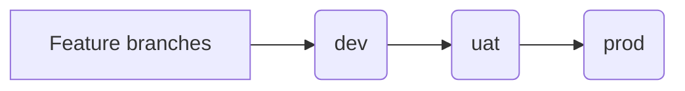
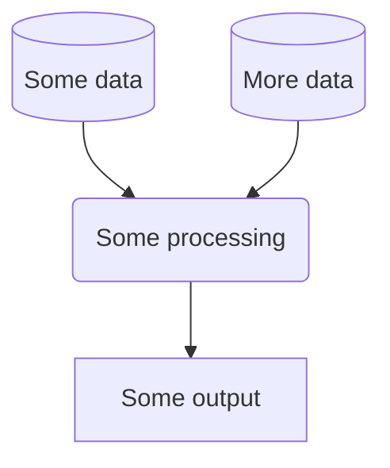

# ClassifAI

# Introduction

## About

Leveraging AI to develop a flexible multi-classification tool.

## Demo API

A demo of the endpoints provided in this project can be accessed in the browser (approved users only and on ONS VPN or approved IPs) [here](https://classifai-sandbox.nw.r.appspot.com/). We currently use a low-spec instance so processing is relatively slow and there is a cold-start after inactivity. You can currently test the embedding search classification by passing a small .csv file with columns **id** e.g. '1', **job_title** e.g. 'Teacher', **company** e.g. 'Derwent School'.

## Installation

You are strongly recommended to install resources into a virtual environment. Project setup can be achieved as follows:

``` bash
git clone https://github.com/datasciencecampus/classifai.git
cd classifai
python -m venv venv
source venv/bin/activate # source venv/Scripts/activate on Windows
python -m pip install --upgrade pip
python -m pip install .
```

> \[!NOTE\] If you intend on doing any development work, please install the package as editable and with the `dev` optional dependencies:
>
> ``` bash
> python -m pip install -e ".[dev]"
> ```
>
> Moreover, once you have installed the package, please install the pre-commit hooks. These hooks help us to ensure repository security and a consistent code style.

### Pre-commit actions

This repository contains a configuration of pre-commit hooks. These are language agnostic and focussed on repository security (such as detection of passwords and API keys). If approaching this project as a developer, you are encouraged to install and enable `pre-commits` by running the following in your shell: 1. Install `pre-commit`:

````
  ```
  pip install pre-commit
  ```
````

2.  Enable `pre-commit`:

    ```
    pre-commit install
    ```

    Once pre-commits are activated, whenever you commit to this repository a series of checks will be executed. The pre-commits include checking for security keys, large files and unresolved merge conflict headers. The use of active pre-commits are highly encouraged and the given hooks can be expanded with Python or R specific hooks that can automate the code style and linting. For example, the `flake8` and `black` hooks are useful for maintaining consistent Python code formatting.

**NOTE:** Pre-commit hooks execute Python, so it expects a working Python build.

## Authentication

The package allows for different embeddings to be used. Based on your choice API keys need to be added:

1.  Include personal Hugging Face API key in .env as `shell     HUGGINGFACE_API_KEY="<your key>"` This needs to be a `WRITE` API key.

2.  Include GCP project API in .env as `shell     GOOGLE_API_KEY="<your key>"` This is created and found in the credentials API on GCP. You will need to restrict the key to the Generative Language API.

## Usage

### REST API

REST APIs are deployed using GCP App Engine. Development is in its early stages. However, 3 GCP-based (but restricted) deployments of the app are available:

[**PROD**](https://ons-dsc-classifai-prod.nw.r.appspot.com) - the closest example of app fit for production

[**UAT**](https://preview-dot-ons-dsc-classifai-prod.nw.r.appspot.com) - a user-acceptance testing app for users to evaluate the latest functionality

[**DEV**]((https://dev-flask-dot-ons-dsc-classifai-prod.nw.r.appspot.com)) - a working app for developers to implement and evaluate new features and functionality

The project workflow for progressing functionality, including the branch merges and deployment triggers can be summarised as follows:



In addition, you can launch the default FastAPI server locally as follows:

``` bash
uvicorn main:app
```

By default, the URL will redirect to the FastAPI Docs UI to try out different inputs.

Note that the vector store for the selected endpoint (SIC or SOC currently) will be imported to a tmp folder (`tmp/soc_db` or `tmp/sic_db`) from the corresponding GCS bucket.

For programmatic demo, a csv file must be passed explicitly as a command flag (`-f` or `--file`). The API server must have been launched, as above. This is only an illustration of functionality at this stage:

``` bash
python submit.py -f data/example_survey_data.csv
```

**Note:** Passing an input in the UI will result in very slow response times. Our product is intended for programmatic use.

A separate utility class is available to copy the ChromaDB vector store files/cache to a GCS bucket. In future, APP Engine instances will draw from this bucket to avoid having to recreate the vector store (the SOC source input is unlikely to change very often). To copy the current ChromaDB files, the following code can be used programmatically:

``` python
from src.classifai.utils import DB_Updater

tool = DB_Updater()
tool.update()
```

> \[!CAUTION\] HuggingFace-hosted embeddings are used by default. However, the EmbeddingHandler object can be updated (for now) by changing the `embedding_model_name` argument in the class `__init__` (e.g. the latest Google embedding model.)

### Web user interface

Alongside the microservice, we are developing a single-page web application to allow colleagues to interactively classify data, assisted by the LLM microservice.

The Flask app is NOT currently deployable locally:

``` bash
python -m flask --app flask_ui/app.py run
```

### Refreshing vector store in GCS Bucket

A utility is available to trigger a job to create a ChromaDB collection for either the **sic** or **soc** task. The collection is created in a tmp folder (`tmp/db/`) locally and automatically pushed to a GCS bucket.

``` python
from src.classifai.utils import setup_vector_store
setup_vector_store("sic") # or "soc"
```

### Generating synthetic survey data

Please note that this process requires local installation of Ollama. To produce a JSON example of survey data, the following command can be used:

``` bash
python src/classifai/generate_labelled_synth_data.py
```

### Workflow

To follow...



# Data Science Campus

At the [Data Science Campus](https://datasciencecampus.ons.gov.uk/about-us/) we apply data science, and build skills, for public good across the UK and internationally. Get in touch with the Campus at [datasciencecampus\@ons.gov.uk](datasciencecampus@ons.gov.uk).

# License

<!-- Unless stated otherwise, the codebase is released under [the MIT Licence][mit]. -->

The code, unless otherwise stated, is released under [the MIT Licence](LICENCE).

The documentation for this work is subject to [© Crown copyright](http://www.nationalarchives.gov.uk/information-management/re-using-public-sector-information/uk-government-licensing-framework/crown-copyright/) and is available under the terms of the [Open Government 3.0](http://www.nationalarchives.gov.uk/doc/open-government-licence/version/3/) licence.

## Versioning

The following steps outline how to use this codebase to manage Scanner project resources:

1.  [Open an issue/ticket](repo-issue) in this repo to reflect the changes you want to make.
2.  Create a new branch. Start the branch name with the issue number, then the project name, and finish with a short description - e.g. `123-awesomeproject-fix-iam`. Once created, also link the branch to the issue/ticket.
3.  If you are adding a new GCP project, create a new directory in the `projects` directory using the project name. Else, navigate to the existing project directory and work on the resources there.
4.  Complete the changes within the respective project directory.
5.  Once the changes are done, update the [CHANGELOG.md](CHANGELOG.md) file summarising the changes you made.
6.  Raise a pull request to merge your branch into the main branch.
7.  Once the pull request is approved and merged into main, tag the commit with the appropriate version number, following the [Semantic Versioning](https://semver.org/spec/v2.0.0.html) guidelines as follows:

``` bash
git fetch
git checkout main
git pull
git tag -a <VERSION> -m <MESSAGE>
git push origin <VERSION>
```

> \[!TIP\] Additional advice on tag versioning (`vMAJOR.MINOR.PATCH`): - Increment the MAJOR version when a new GCP project is added. - Increment the MINOR version when a new resource is added to an existing GCP project. - Increment the PATCH version when a bug is fixed or a resource is updated.

<!-- links -->
