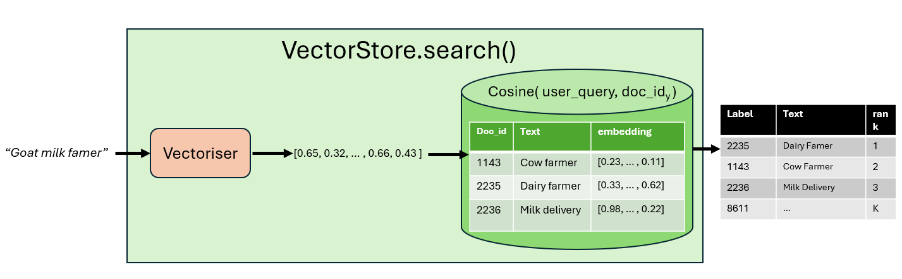

# ClassifAI

ClassifAI is a Python package that simplifies semantic search and Retrieval Augmented Generation (RAG) pipelines for classification tasks in the production of official statistics. It is designed to help data professionals build applications and pipelines to label new text samples to official statistical classifications, by leveraging (augmented) semantic search over a knowledgebase of previously coded examples.

The Office for National Statistics often needs to classify free-text survey responses or other data to standard statistical classifications. The most well-known examples include the Standard Industrial Classification ([SIC](https://www.gov.uk/government/publications/standard-industrial-classification-of-economic-activities-sic)), the Standard Occupational Classification ([SOC](https://www.ons.gov.uk/methodology/classificationsandstandards/standardoccupationalclassificationsoc)), and the Classification Of Individual COnsumption according to Purpose ([COICOP](https://en.wikipedia.org/wiki/Classification_of_Individual_Consumption_According_to_Purpose)), as well as international equivalents such as [ISCO](https://esco.ec.europa.eu/en/about-esco/escopedia/escopedia/international-standard-classification-occupations-isco) and [ISIC](https://en.wikipedia.org/wiki/International_Standard_Industrial_Classification). The ClassifAI package has been designed specifically to help us build applications, pipelines and analyses for this kind of task.

Use cases:

- **Web apps**: ClassifAI can provide a production-ready, batteries-included REST interface to serve as a backend for web applications that need to code free text
- **Pipelines**: using either the Python SDK or the REST mode, ClassifAI can be a key ingredient in scheduled statistical processing pipelines
- **Analysis**: ClassifAI is simple enough to be used for one-off classification tasks. It requires no training or fine-tuning, and can give accurate results out-of-the-box, dependent only on the quality of the knowledgebase.

Key Features of the package include:

- Use included vectorisers (including Google Cloud, Huggingface and Ollama embedders) or implement your own 
- Built in support for custom hook logic - choose from a library of pre-processing and post-processing functions that control the flow of data (spell checking, results deduplication, etc) or write your own hooks
- Deploy Easily with FastAPI - Deploy your semantic search classifier with FastAPI capabilities built into the package for easy REST API deployment

## What are semantic search and RAG?

ClassifAI facilitates text classification using semantic search over a knowledgebase (possibly augmented by RAG).
The knowledgebase is a collection of pieces of text (called "documents" even if they're very short) with a known classification label that serve as a reference for the classification task. They might be canonical definitions of each classification label, or examples of correct labelling, or a combination of those.

**Semantic search** uses a vectoriser (usually a language model) to convert each document into a vector (called an embedding). When a query (another piece of text) arrives from the user, the query is first embedded in the same way as a vector of numbers, then the query embedding is compared to each of the embeddings in the knowledgebase by calculating similarities between vectors. The top _N_ closest knowledgebase entries are returned along with the matching labels, documents and distance scores for each one.

**Retrieval-augmented generation (RAG)** entails feeding search results into the prompt of a generative language model, with instructions for the model to further process the result. In the context of the package, RAG is constrained to operate on structured result sets and return result sets with the same structure.




## Why this approach?

The knowledgebase search approach to classification has advantages and disadvantages compared to machine learning (ML) approaches that train a model for the task. On balance, this approach is well-suited to statistical production use cases. To make a fair comparison between ML and knowledgebase search, it helps to think of the knowledgebase as training data, and compare the performance when the size of the training dataset is similar to the size of a knowledgebase (tens to low hundreds of thousands)

**Advantages**

- **Explainability**: it's relatively easy to understand why ClassifAI produced a result, because the matching knowledgebase entries are provided
- **Agility**: the quality of results can be tweaked by adding or removing a handful of knowledgebase entries, without expensive retraining
- **Accountability**: the knowledgebase can be maintained and developed by professional methodologists, separate from the developer team
- **Time-to-prototype**: Because no training or feature engineering is needed, it's possible to have a working prototype producing reasonable results in minutes
- **Customisation**: the method is easily customisable with the option to easily swap vectorisers, knowledgebases and pre- and post-processing hooks
- **Accuracy**: the knowledgebase approach can produce results with accuracy comparable to machine learning approaches in like-for-like comparisons
- **Large, unbalanced label sets**: ML approaches tend not to work well on label sets like SIC, SOC or COICOP where the set of classifications is large and unbalanced, and the training data may be sparse for some classifications. Knowledgebase search works well in these cases

**Disadvantages**

- **Uncertainty quantification**: the knowledgebase approach doesn't produce calibrated uncertainty measures out-of-the-box, although there are methods (such as conformal prediction) that show promise
- **Scaling**: the knowledgebase approach has been tested and works well on mid-scale training data and may not scale as well as ML approaches on big data
- **Cost**: Cloud-provided vectorisers have a per-request cost, although this is usually small and outweighed by the cost of developer FTEs

The comparison on other aspects, such as per-request speed or hardware requirements is less clear because no formal comparison has been undertaken. ClassifAI is in production in the ONS and appears to provide results quickly enough for users.


---


## Table of Contents


- [Installation](#installation)
- [Example: Indexing and Searching a Document Collection](#example-indexing-and-searching-a-document-collection)
- [Dev set-up and contributing](#contributing-to-this-repo-and-development-setup)
- [Contact and Support](#contact-and-support)


## Installation

Install the package directly from GitHub in your Python environment

```bash
pip install "https://github.com/datasciencecampus/classifai/releases/download/v0.2.1/classifai-0.2.1-py3-none-any.whl"
pip install "classifai[huggingface]"
```

or if you are using Astral UV

```bash
uv pip install "https://github.com/datasciencecampus/classifai/releases/download/v0.2.1/classifai-0.2.1-py3-none-any.whl[huggingface]"
```

## Example: Indexing and searching a knowledgebase

ClassifAI supports statistical classification through searching a knowledgebase. The knowledgebase is a set of labelled examples that show how different texts (e.g. survey responses) map to statistical classifications.
The size and quality of the knowledgebase dictates the quality of results you can expect from using the tool.

#### Step 1: Choose a vectoriser

A vectoriser transforms a query text string into an embedding vector. You can choose from embedding models accessed via HuggingFace, Google or Ollama, or build your own vectoriser.

```python
from classifai.vectorisers import HuggingFaceVectoriser

# Create a vectorizer model
vectoriser = HuggingFaceVectoriser(model_name="sentence-transformers/all-MiniLM-L6-v2")

# You can use the 'transform' method to call the vectoriser
vector = vectoriser.transform("Example text to vectorize")
print(vector.shape)
```

#### Step 2: Build a vector store

You provide a knowledgebase of labelled examples (currently only allows data to be provided as a csv) to build a vector store

```python
from classifai.indexers import VectorStore

vector_store = VectorStore(
    file_name="occupations_knowledgebase.csv",
    vectoriser=vectoriser,
    batch_size=8,
    output_dir="vector_store"
)
```

#### Step 3: Search the vector store

The query is provided as a dataframe-like object to the search method, and the results are returned as a dataframe-like object.
```python
from classifai.indexers.dataclasses import VectorStoreSearchInput

input_data = VectorStoreSearchInput({'id': [1], 'query':["construction worker scaffolder"]})

results = vector_store.search(input_data, n_results=5)
print(results)
```

#### Step 4: Deploy as a REST API

You can use ClassifAI as a local package, or deploy it as an API server, using FastAPI.

```python
from classifai.servers import start_api

start_api(vector_stores=[vector_store], endpoint_names=["Occupations"], port=8000)
```

#### Learn more

Further guides and tutorials can be found in the [DEMO folder](./DEMO/) of this repo. It currently includes the following notebooks:

- [General workflow](./DEMO/general_workflow_demo.ipynb)
- [Custom vectorisers](./DEMO/custom_vectoriser.ipynb)
  - make your own custom vectoriser model that will interact with the core features of the package,
- [Custom pre- and post-processing hooks](./DEMO/custom_preprocessing_and_postprocessing_hooks.ipynb)
  - Add your own custom 'hook' logic to the VectorStore search processes, allowing you to inject custom behaviour to your VectorStores.
- (more demos to come soon)

## Contributing to this repo and development Setup

If you are a developer working on ClassifAI, this section describes how to set up the repo correctly on your local machine to start working on the codebase. 3rd party developers please also read [CONTRIBUTING.md](./CONTRIBUTING.md)

<b>NOTE</b>: This section is for developers who are making alterations and changes to the codebase of this repo itself, not for developers who are using the features of the package.


To begin making changes to the codebase follow the following instructions on your development machine:

1. Clone the repo:
```bash
git clone git@github.com:datasciencecampus/classifAI.git

cd classifAI
```

2. Set up pre-commit hooks:
```bash
make setup-git-hooks
```
  (or, if you don't have Docker available)
```bash
make setup-git-hooks-no-docker
```

3. Create / activate the virtual environment:
```bash
uv lock

uv sync
```

And that's you good to go!

During development, you might want to run linters / code vulnerability scans; you can do so at any point via

```bash
make check-python
```


## Contact and Support

In the event that you come across any issues such as potential bugs in the code or something that may be unclear or not explained in the various DEMO content, please read [CONTRIBUTING.md](./CONTRIBUTING.md) file for instructions. It contains sections on Getting Help, Asking Questions, Reporting Bugs, and other guides on working with the package.
