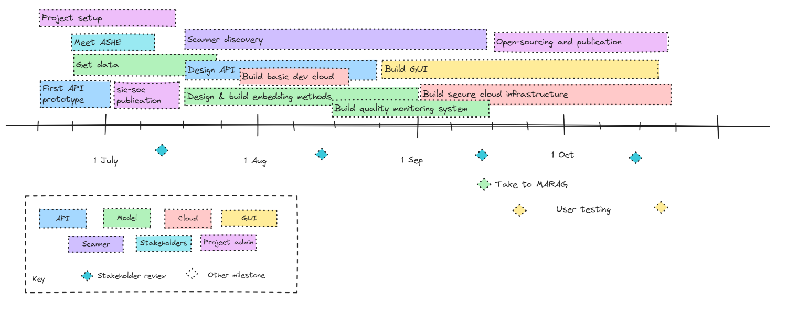

## Overview

## Big plan

* Front-end: Me
* Back-end: Edward
* Core logic: Jyl

Ready for parallel coding by beginning of November.

### 1. Core logic

* We need a general architecture that can support different kinds of retrieval and reranking
* Support different use-cases

Pipeline:

1. Receive request
2. Construct prompt (should this happen at Flask or even front-end?)
3. Spell check, chunk and simplify/normalise
4. Check cache
5. Embed
6. Query vector store and return N results
7. Rerank/score/assess
8. Apply conformal thresholds
9. Prune (with conformal prediction thresholds)
10. Augment (e.g. with LLM-generated questions)
11. Return response

### 2. front-end web app

* one input file, one output file, one in-memory working file (duplicated in filesystem) and one API response.
	* data.in (exact same format as GCode)
	* data.out (exact same format as GCode)
	* working.csv (Not exact same format as GCode)
	* response.json (The current response, saved to disk periodically)
* Define the session lifecycle
	* 'Refresh results'
	* 'Close data'
* Telemetry: logging app activity
* Customise the look of the app for SIC
* Feature: As a user, I want to type an alternative description into the text box, and fetch another query. I want that to be persisted in data.working and replace the orig data in data.out
* Make it as 'native' as possible (PWA)
* Needs to be really modular and well-documented

**Flask server**

* Handle authentication sessions
* Are we going to attach a database to this to store user requests?

### 3. API service

* Do we need to switch off authentication?
* Is the format we have good to fix?
* Implement query parameter for N-results
* Implement query parameter for conformal prediction
* Pagination? Parallelisation?

### 4. Codebase and project organisation

* Files and folders at root level need rationalising. What can be packages?
* Tidy up .gitignore and ensure the data/ folder is excluding what it should
* Does Terraform stuff belong in the package? What about Terraform lockfile?
* Need to keep tests up to date
* Keep documentation up to date
* The OOP structure of the core logic needs reviewing

### 5. Stakeholders and users

* Will need approval from methodology
* Will need approval from DST

### 6. Cross-cutting questions

* What data should be stored and where?
*
